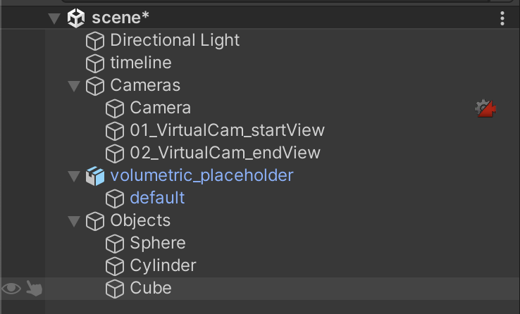

# Unity to Touchdesigner camera workflow - without gaussian splats
{: .no_toc }

  

    Table of contents
  

  {: .text-delta }
- TOC
{:toc}

 ---

## Unity

### Packages used

- Cinemachine
- FBX exporter

### Scene set up

1. Set up your Unity scene. Your current scene at least needs a moving camera with a Cinemaching Brain(Camera), a placeholder for the things you want to add in Touchdesigner(volumetric_placeholder) and the objects you want to record in Unity(Objects).

2. Add your animations to the timeline - in this example we used a simple camera blend using Cinemachine to move the camera

### Baking the camera animation

3. Right click on our Timeline to add a recorder track

4. I rename this track animation, then right click on the track to add recorder clip

5. repeat step 3 + 4, but now rename the track to mp4
6. make sure the length of both recorder clips is the same length as the scene you want to record

7. select animation recorder clip and in inspector change the selected recorder to animation clip. Change GameObject to the camera you want to record the animation of. Set the output location to be inside your Assets folder.

8. now select the RecorderClip of mp4 and select the desired export settings of the Unity scene recording. For now we will keep the placeholder to test if everything works properly. Set the output location.

9. press Play and let the timeline play in full. Both the animation and mp4 recording will be exported.

10. Create a new camera in your scene using the same FOV settings as your main camera. Don’t use a Cinemachine brain. 
11. Drag the .anim file you exported earlier on top of the export camera. It will be added as the animator now. 
12. Disable your main camera, now press Play again to confirm the baked animation is the same as original.

13. right-click on your export camera and select *Export to FBX…*

## Touchdesigner

1. Create a new touchdesigner project and drag your animation .FBX
2. doubleclick the node to open it
3. in the animation node go to the Playback tab and turn “use parent animation” off
4. change play mode to “Locked to Timeline”

1. drag in your animation video and set Play Mode also to locked to Timeline

1. add the Touchdesigner 3D components you wish to add to your Unity scene recording, in this case it is Volumetrics. Don’t forget to add the same offset as the placeholder in Unity 

{: .warning }
> Unity and Touchdesigner have an opposite X axis, this means positive numbers turn into negative, and negative into positive. We also have to add -90 degrees to the Y axis

1. create a new Null for your camera and use the CHOP Reference of ExportAnim to fill in the transformation and rotation.

{: .warning }
> the scale of the animation is imported 100x larger than our touchdesigner file. make sure to add /100 all the transformations to make it fit properly

1. connect your null2 to the camera

1. add render and comp nodes and connect everything. it’s done!

