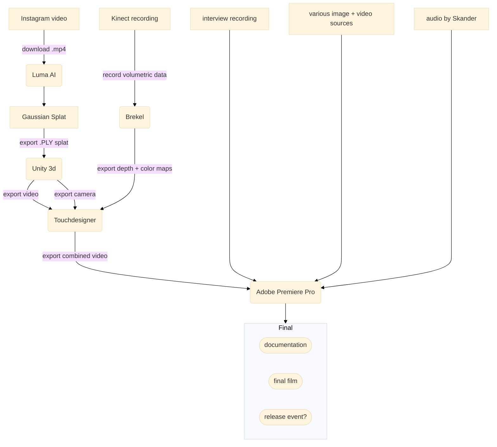

# Documentation
**Workflows used in the production of Volumetric Interview #4 Now You See Me Moria**

### Software used
- Brekel
- Unity
    - Toy Gaussian package
    - Cinemachine package
- Touchdesigner
- Premiere Pro

